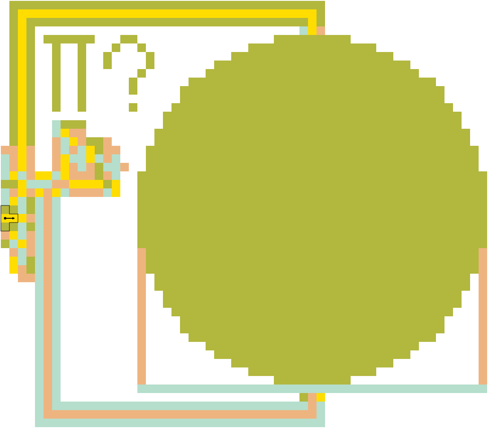
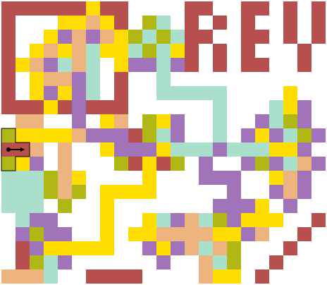

Turnstyle is a graphical [esoteric programming language] loosely inspired by
[Piet].  Both encode programs as images, however, the similarities end at the
syntax level.

Where Piet is really a stack machine in disguise, Turnstyle is an encoding of
the (untyped) [Lambda calculus].  This allows for building more reusable images
at a higher level of abstraction, while still keeping the specification small,
making it relatively easy to develop new interpreters.

This repository contains [the language specification](spec/), a reference
implementation in Haskell, and a
[simple JavaScript implementation](turnstyle.js).

# Specification

The cheatsheet below provides a high-level overview, for more details please
consult [the Turnstyle Language Specification](spec/).

# Examples

The starting Turnstyle shape is outlined.  Click on the examples to run them in
the browser.

## pi

Prints an approximation of _pi_ by comparing the circle to its diameter:

## rev

Uses a [Y combinator] (indicated by the red rectangle in the top left)
and [continuation-passing style] to implement the Unix `rev` program.
Type lines into the terminal to revert them.

## loop

Of course, fixed-point combinators are a primitive tool necessary to compensate
for the limitations of one-dimensional programming.  In two-dimensional
programs, we can achieve recursion using a more visually intuitive approach.
This program prints the sequence of natural numbers:

# Design Principles

In roughly this order:

1.  Above all, in the spirit of Lambda calculus, the specification must be
    simple and unambigious.
     -  Have a single numeric type that support exact as well as inexact
        operations.
     -  Referential transparency will allow users to share and reuse images.
     -  Prefer Church encoding over adding new built-in types where possible.
2.  Preserve the suspension of disbelief concerning using this for real
    programs:
     -  Allow for building fast compilers, type systems and tooling.
     -  Have an extensible system for primitives so things like networking and
        file IO can be added in.
     -  An Array type could be added for efficiency, since there is no good way
        to build _O(1)_ indexing using Church encoding.
3.  Allow plenty of creative freedom in the choice of colors and shapes.
     -  Make sure it possible to create very dense images where specific pixels
        are reused in several expressions.
4.  Represent integers as areas as a nod to Piet (as a side effect, 0 does not
    exist as a literal).

[continuation-passing style]: https://en.wikipedia.org/wiki/Continuation-passing_style
[esoteric programming language]: https://en.wikipedia.org/wiki/Esoteric_programming_language
[Lambda calculus]: https://en.wikipedia.org/wiki/Lambda_calculus
[Piet]: https://www.dangermouse.net/esoteric/piet.html
[Y combinator]: https://en.wikipedia.org/wiki/Fixed-point_combinator
